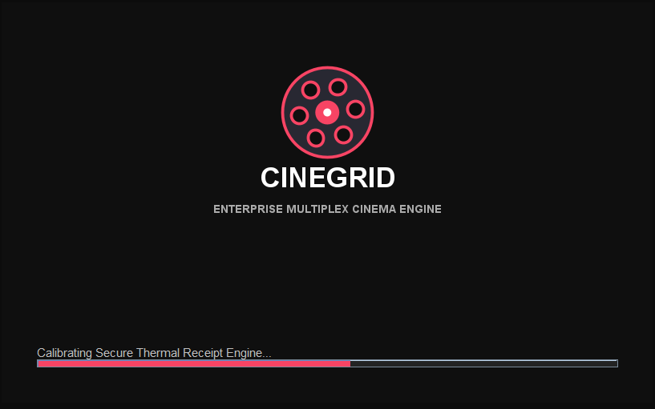
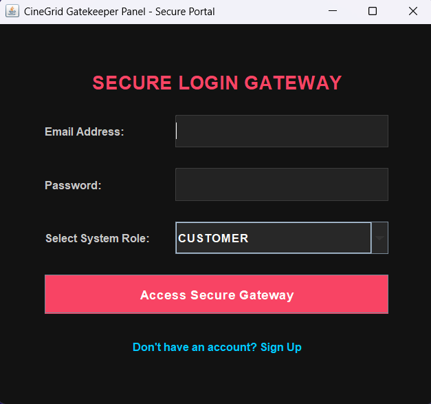
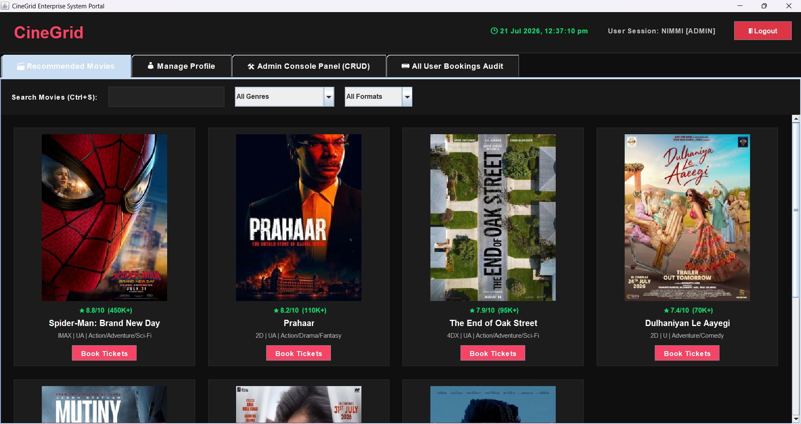
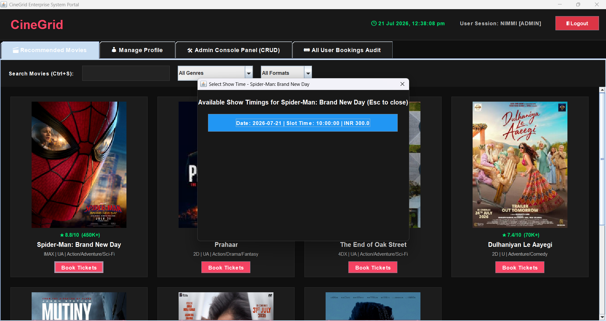
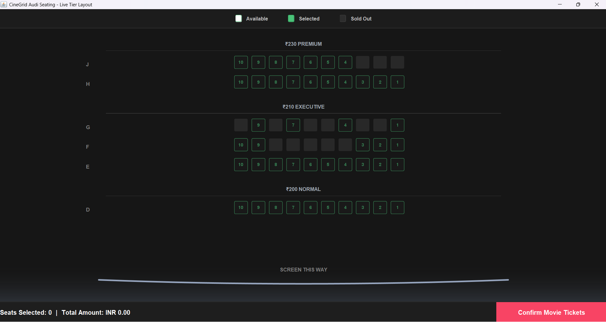
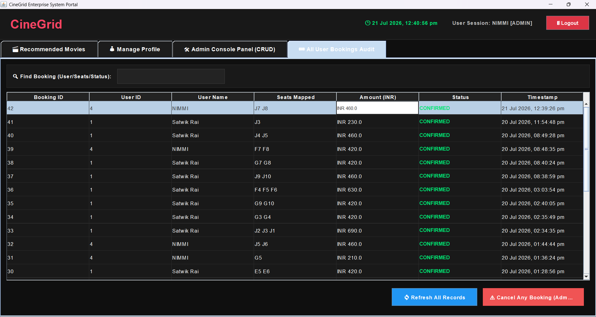
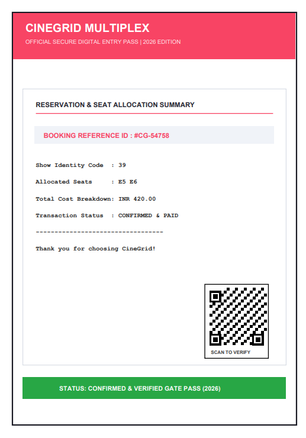
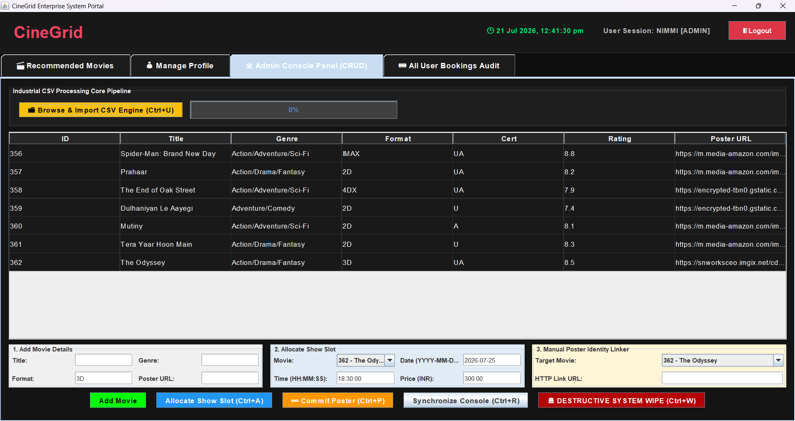
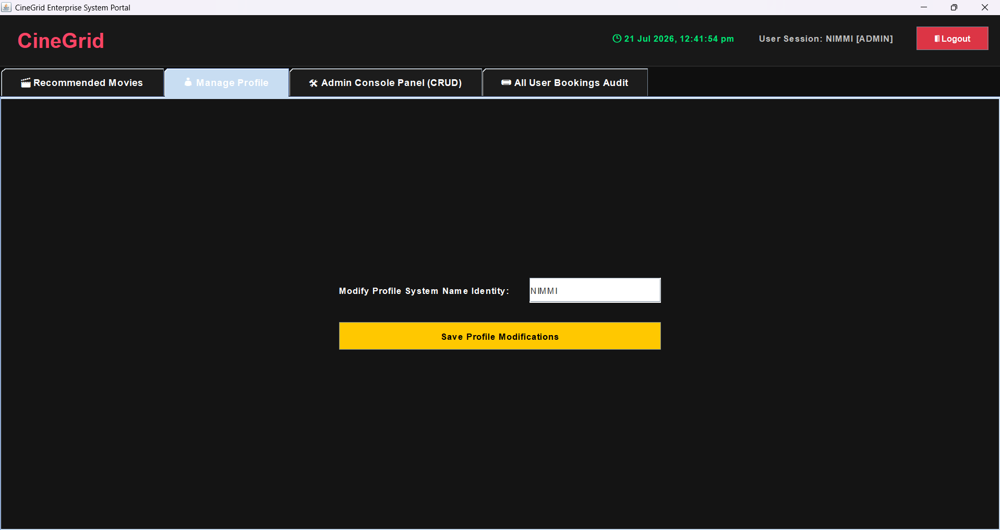
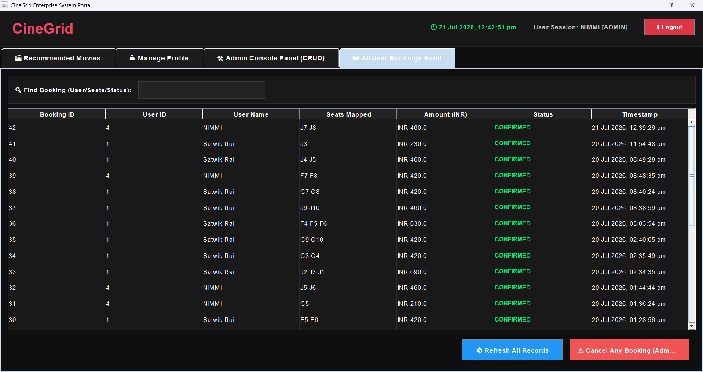

<div align="center">

# 🎬 CineGrid - Movie Booking System

### A Modern Java Swing Desktop Application for Smart Movie Ticket Booking

<p align="center">
  
  
  
  
  
  
</p>

### 🎟️ Browse Movies • Select Seats • Book Tickets • Print Receipts

---
# 📸 Application Screenshots

Experience the complete CineGrid workflow, from launching the application to booking movie tickets and managing the system through the admin portal.

---

## 🚀 Splash Screen

<p align="center">
  
</p>

---

## 🔐 Secure Login Gateway

<p align="center">
  
</p>

---

## 🏠 User Dashboard

Browse movies with an elegant dark-themed interface, search functionality, genre filters, and booking options.

<p align="center">
  
</p>

---

## 🎬 Movie Catalogue

View recommended movies with posters, ratings, formats, genres, and available show timings.

<p align="center">
  
</p>

---

## 💺 Interactive Seat Selection

Select available seats with real-time visual seat mapping and dynamic pricing.

<p align="center">
  
</p>

---

## 🎟 Booking Confirmation

Choose a show time and confirm your booking before proceeding to ticket generation.

<p align="center">
  
</p>

---

## 📄 PDF Movie Ticket

Automatically generate a professional printable PDF ticket with booking details and QR verification.

<p align="center">
  
</p>
---

## 🛠️ Admin Console

Import movie data, allocate show slots, synchronize posters, and manage the entire movie catalogue through the administrative dashboard.

<p align="center">
  
</p>

---

## 👤 Profile Management

Users can update their profile information directly from the application.

<p align="center">
  
</p>

---

## 📊 Booking Audit Dashboard

Administrators can monitor all bookings, search records, refresh data, and cancel bookings when required.

<p align="center">
  
</p>

---


### ⭐ If you like this project, don't forget to star the repository!

</div>

---

# 📑 Table of Contents

- About
- Features
- Screenshots
- Technology Stack
- Project Architecture
- Project Structure
- Database
- Installation
- Running the Project
- Modules
- Future Enhancements
- Contributing
- License
- Author

---

# 📖 About

**CineGrid** is a desktop-based Movie Ticket Booking System developed using **Java Swing** and **MySQL**.

The application provides an intuitive graphical interface that allows users to browse movies, select seats, manage bookings, and generate printable tickets.

The project demonstrates real-world implementation of:

- Object-Oriented Programming
- Java Swing GUI Development
- JDBC Database Connectivity
- CRUD Operations
- Modular Software Architecture
- PDF Ticket Generation
- Receipt Printing

It is designed as an academic as well as portfolio project to demonstrate Java desktop application development.

---

# ✨ Features

## 👤 User Features

- Secure Login
- User Registration
- Browse Available Movies
- Interactive Dashboard
- Movie Details
- Seat Selection
- Movie Ticket Booking
- Booking Confirmation
- Printable Receipt
- PDF Ticket Export
- User-friendly Interface

---

## 🎬 Booking Features

- Real-time Seat Selection
- Seat Availability
- Booking Records
- Customer Details
- Ticket Generation
- Booking Confirmation

---

## 🛠️ System Features

- Splash Screen Animation
- Secure Authentication
- MySQL Database Integration
- Modular Architecture
- Responsive Swing UI
- Exception Handling
- Clean Navigation
- JDBC Connectivity

---

# 📸 Application Screenshots

> Replace the images below after uploading screenshots inside the **screenshots** folder.

---

## 🖥 Splash Screen


---

## 🔐 Login Screen


---

## 🏠 Dashboard


---

## 🎥 Movie Selection


---

## 💺 Seat Selection


---

## 🎟 Booking Confirmation


---

## 📄 Generated Ticket


---

## 🗄 Database


---

# ⚙ Technology Stack

| Technology | Purpose |
|------------|----------|
| Java | Programming Language |
| Java Swing | Desktop GUI |
| JDBC | Database Connectivity |
| MySQL | Backend Database |
| NetBeans IDE | Development Environment |
| OOP | Software Design |

---

# 🏛 Project Architecture

```text
                +---------------------+
                |      MainApp        |
                +----------+----------+
                           |
                           |
                +----------v----------+
                | SplashScreenFrame   |
                +----------+----------+
                           |
                           |
                +----------v----------+
                |     AuthFrame       |
                +----------+----------+
                           |
               +-----------+-----------+
               |                       |
               |                       |
        Customer Login          Administrator
               |                       |
               +-----------+-----------+
                           |
                           |
                +----------v----------+
                |  DashboardFrame     |
                +----------+----------+
                           |
               +-----------+-----------+
               |                       |
               |                       |
        SeatSelectionFrame      BookingDAO
               |                       |
               +-----------+-----------+
                           |
                           |
                     MySQL Database
```

---

# 📂 Project Structure

```text
CineGrid
│
├── src
│   └── com
│       └── cinegrid
│           ├── config
│           │   ├── DBConfig.java
│           │   └── ImportDatabase.java
│           │
│           ├── dao
│           │   └── BookingDAO.java
│           │
│           ├── model
│           │   ├── Customer.java
│           │   ├── Seat.java
│           │   └── User.java
│           │
│           ├── util
│           │   ├── PdfTicketExporter.java
│           │   ├── ReceiptPrinterUtil.java
│           │   ├── SecurityUtil.java
│           │   └── TransitionLoader.java
│           │
│           ├── view
│           │   ├── SplashScreenFrame.java
│           │   ├── AuthFrame.java
│           │   ├── DashboardFrame.java
│           │   └── SeatSelectionFrame.java
│           │
│           ├── MainApp.java
│           └── ProjectBuilder.java
│
├── screenshots
├── build
├── dist
├── test
├── README.md
└── LICENSE
```

---

# 🗄 Database

The project uses **MySQL** as its backend database.

### Main Tables

- Users
- Customers
- Movies
- Bookings
- Seats

The database stores:

- User Information
- Customer Details
- Seat Availability
- Booking Records
- Movie Information

---

# 🚀 Installation

## Clone Repository

```bash
git clone https://github.com/Satwik51/CineGrid-Movie-Booking-System.git
```

---

## Open Project

Open the project using

```
Apache NetBeans IDE
```

---

## Create Database

```sql
CREATE DATABASE cinegrid;
```

Import the SQL file into MySQL.

---

## Configure Database

Update the database credentials inside

```
DBConfig.java
```

Example

```java
String url = "jdbc:mysql://localhost:3306/cinegrid";
String username = "root";
String password = "your_password";
```

---

## Run

Run

```
MainApp.java
```

---

# 💻 System Requirements

- Java JDK 17+
- Apache NetBeans IDE
- MySQL Server
- MySQL Connector/J
- Windows 10/11

---

# 📦 Project Modules

## Authentication Module

- Login
- Registration
- Password Validation

---

## Dashboard Module

- Movie Listing
- Navigation
- User Dashboard

---

## Booking Module

- Seat Selection
- Booking
- Ticket Generation

---

## Utility Module

- PDF Export
- Receipt Printing
- Security Utility
- Loading Animation

---

## Database Module

- JDBC
- CRUD Operations
- Data Persistence

---

# 🎯 Learning Outcomes

This project demonstrates:

- Java Swing GUI Development
- Object-Oriented Programming
- JDBC Connectivity
- Database Management
- Modular Architecture
- Event Handling
- Exception Handling
- Desktop Application Development

---

# 🚀 Future Enhancements

- Online Payment Gateway
- QR Code Ticket
- Email Notifications
- SMS Alerts
- Movie Ratings
- Dark Theme
- Online Seat Availability
- Multi-Cinema Support
- REST API Integration
- Cloud Database
- Mobile Application

---

# 🤝 Contributing

Contributions are welcome.

1. Fork the repository
2. Create a new branch

```bash
git checkout -b feature-name
```

3. Commit your changes

```bash
git commit -m "Added new feature"
```

4. Push

```bash
git push origin feature-name
```

5. Create a Pull Request

---

# 📄 License

This project is licensed under the MIT License.

---

# 👨‍💻 Author

## Saurabh

### GitHub

https://github.com/Satwik51

---

<div align="center">

## ⭐ Star this repository if you found it useful!

Made with ❤️ using **Java**, **Swing**, and **MySQL**

</div>
